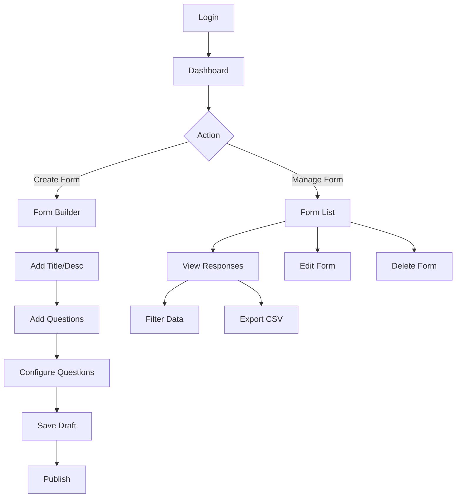
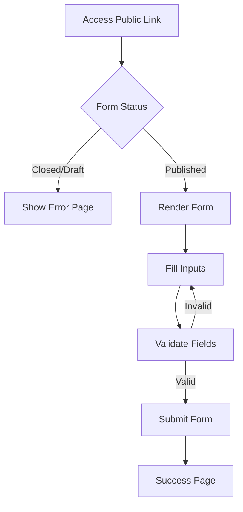

# Form Builder System Design

## 1. Flow Diagrams

### Admin Flow

### User (Respondent) Flow

## 2. API Route Structure (Next.js App Router)

Root: `app/api`

| Route | Method | Description |
|-------|--------|-------------|
| **/auth/[...nextauth]** | GET/POST | Authentication (NextAuth) |
| **/forms** | GET | List all forms (Admin) |
| **/forms** | POST | Create a new form |
| **/forms/[formId]** | GET | Get form details (Admin) |
| **/forms/[formId]** | PATCH | Update form metadata |
| **/forms/[formId]** | DELETE | Delete form |
| **/forms/[formId]/questions** | POST | Add question to form |
| **/forms/[formId]/questions/[qId]** | PATCH | Update question |
| **/forms/[formId]/questions/[qId]** | DELETE | Remove question |
| **/forms/[formId]/publish** | POST | Toggle status (Publish/Unpublish) |
| **/forms/[formId]/responses** | GET | Fetch form responses (Admin) |
| **/forms/[formId]/export** | GET | Export responses as CSV |
| **/public/forms/[slug]** | GET | Public form data (without sensitive admin info) |
| **/public/forms/[slug]/submit** | POST | Submit form response |

## 3. UI Component Breakdown

### Core Components
- **Button**: Variants (primary, secondary, danger, ghost).
- **Input / Textarea**: Standard form controls.
- **Card**: Container for sections.
- **Modal**: For confirmations or settings.
- **Toast**: Notifications (Success/Error).
- **Spinner**: Loading state.

### Admin Components
- **DashboardLayout**: Sidebar navigation, User profile.
- **FormCard**: Display summary of a form in the list.
- **FormBuilder**:
    - **DraggableQuestionList**: Sortable list container.
    - **QuestionEditor**: Form to edit question properties (Label, Type, Required).
    - **Toolbox**: Sidebar to drag new questions from.
- **ResponseTable**: Data grid with sorting and pagination.

### Public Components
- **FormRenderer**: Takes form schema and renders questions.
- **QuestionRenderer**: Dynamic component that renders the correct input based on `type`.
    - `ShortText`, `Paragraph`, `NumberInput`, `EmailInput`, `DateInput`
    - `SelectInput`, `RadioGroup`, `CheckboxGroup`
    - `FileUpload`
- **ValidationMessage**: Shows Zod error messages.

## 4. Best Practices for Scalable Form Builder

### Architecture & Performance
- **Server Components**: Use React Server Components (RSC) for fetching form data and lists to reduce client bundle size.
- **Server Actions**: Use Server Actions for form mutations (Create, Update, Submit) to ensure progressive enhancement and type safety.
- **Zod Validation**: Share Zod schemas between client (form validation) and server (API validation) to ensure consistency.
- **Optimistic UI**: Implement `useOptimistic` for instant feedback when adding/moving questions in the builder.

### Data Management
- **JSON for Complex Answers**: Store complex answers (like multi-select checkboxes) as serialized JSON in the `value` field or use a separate relational table if querying by specific option is required frequently.
- **Slug Uniqueness**: Ensure efficient unique slug generation for public URLs.

### Security
- **Rate Limiting**: Apply rate limiting on the `/submit` endpoint to prevent spam.
- **Input Sanitization**: Sanitize user inputs to prevent XSS, although React handles most of this.
- **Authorization**: Strict checks on Admin routes to ensure a user owns the form they are editing.

### UX
- **Auto-save**: Implement auto-save in the Form Builder to prevent data loss.
- **Accessibility (a11y)**: Ensure all form inputs have proper labels and ARIA attributes.
